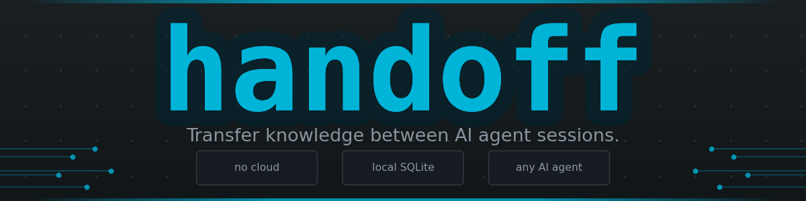
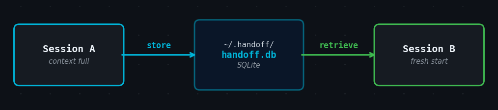

<p align="center">
  
</p>

<p align="center">
  <a href="https://github.com/Radixen-Dev/handoff/releases"></a>
  <a href="https://go.dev"></a>
  <a href="https://img.shields.io/badge/platform-macOS%20%7C%20Linux%20%7C%20Windows-lightgrey"></a>
  <a href="LICENSE"></a>
  <a href="https://radixen.com/handoff"></a>
</p>

<br>

<p align="center">
  Every AI agent session has a memory limit.<br>
  When it fills, everything accumulated — decisions, progress, context — disappears.<br>
  The next agent starts from zero.<br><br>
  <code>handoff</code> stores structured knowledge before the window closes,<br>
  so the next session picks up exactly where the last one left off.
</p>

<br>

<p align="center">
  
</p>

---

## Install

**macOS / Linux**

```bash
brew tap Radixen-Dev/tap
brew install handoff
```

**All platforms** (requires Go 1.26+)

```bash
go install github.com/Radixen-Dev/handoff@latest
```

**Windows** — download a pre-built `.zip` from the [releases page](https://github.com/Radixen-Dev/handoff/releases), extract it, and place `handoff.exe` on your `%PATH%`.

> Full guide — PATH setup, build from source, all platforms → **[Install →](https://radixen-dev.github.io/handoff/install/)**

---

## Quick Start

### Session A — context is filling up

You tell the agent:

> *"Our context is getting large. Do a handoff."*

The agent composes a structured summary of current state — decisions made, work in progress, next steps, gotchas — and stores it:

```
Done — stored as a3f9c12e
```

### Session B — fresh session, zero re-explaining

You say:

> *"Retrieve knowledge package a3f9c12e."*

The agent fetches the full summary and resumes exactly where work left off, without any re-explaining of the project.

> [!NOTE]
> The agent handles `handoff store` and `handoff retrieve` internally. You never need to run them yourself. See the **[Commands reference →](https://radixen-dev.github.io/handoff/commands/)** for the full details.

---

## Commands

```
handoff store         Read from stdin → save as a named package → print 8-char ID
handoff retrieve      Fetch by ID or name → write full content to stdout
handoff list          Show all live packages in a clean table
handoff gc            Purge all expired packages on demand
handoff completion    Shell completion for bash, zsh, fish, and PowerShell
```

All five commands share a single SQLite file at `~/.handoff/handoff.db` (macOS/Linux) or `%USERPROFILE%\.handoff\handoff.db` (Windows).

> **[Full command reference — flags, output examples, error tables →](https://radixen-dev.github.io/handoff/commands/)**

---

## Agent Setup

Drop one file into your project. The agent will automatically check for existing packages at session start, offer proactive transfers when context grows large, and respond to phrases like *"do a handoff"* or *"save context"*.

### Always-on instruction files

Loaded every session. Install once per project.

| Agent | File | One-line install |
|-------|------|-----------------|
| Claude Code | `CLAUDE.md` | `curl -fsSL https://raw.githubusercontent.com/Radixen-Dev/handoff/main/instructions/CLAUDE.md -o CLAUDE.md` |
| GitHub Copilot | `.github/copilot-instructions.md` | `curl -fsSL https://raw.githubusercontent.com/Radixen-Dev/handoff/main/instructions/copilot-instructions.md -o .github/copilot-instructions.md` |
| OpenAI Codex | `AGENTS.md` | `curl -fsSL https://raw.githubusercontent.com/Radixen-Dev/handoff/main/instructions/AGENTS.md -o AGENTS.md` |
| Cursor | `.cursor/rules/handoff.mdc` | `curl -fsSL https://raw.githubusercontent.com/Radixen-Dev/handoff/main/instructions/cursor.mdc -o .cursor/rules/handoff.mdc` |

### On-demand skill files

> [!TIP]
> Prefer this when you want `handoff` loaded only when the agent recognizes a handoff request, rather than on every session.

| File | Agent |
|------|-------|
| `.claude/skills/handoff/SKILL.md` | Claude Code |
| `.github/skills/handoff/SKILL.md` | GitHub Copilot |
| `.agents/skills/handoff/SKILL.md` | OpenAI Codex and others |

> **[Agent Setup guide — always-on vs. skill files, comparison and tradeoffs →](https://radixen-dev.github.io/handoff/agents/)**

---

## Configuration

`handoff` has exactly one setting.

| Variable | Default | Description |
|----------|---------|-------------|
| `HANDOFF_DB` | `~/.handoff/handoff.db`<br>`%USERPROFILE%\.handoff\handoff.db` (Windows) | Path to the SQLite database file |

There is no config file. Set the variable or don't — either way, it works.

---

## Documentation

Full documentation at **[radixen-dev.github.io/handoff](https://radixen-dev.github.io/handoff/)**

| | |
|--|--|
| [Install](https://radixen-dev.github.io/handoff/install/) | All install methods, PATH setup, pre-built binaries, uninstall |
| [Commands](https://radixen-dev.github.io/handoff/commands/) | Full flag reference, output examples, error handling |
| [Agent Setup](https://radixen-dev.github.io/handoff/agents/) | Always-on vs. skill files, per-agent curl commands |
| [Workflow](https://radixen-dev.github.io/handoff/workflow/) | The two-session pattern, recommended package format |
| [How It Works](https://radixen-dev.github.io/handoff/internals/) | SQLite schema, IDs, TTL, GC, design principles |

---

MIT — see [LICENSE](LICENSE).
